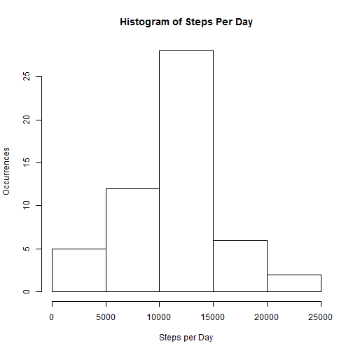
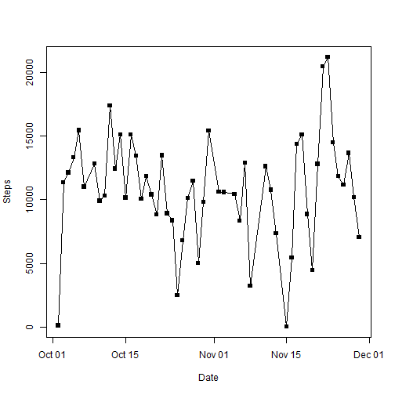
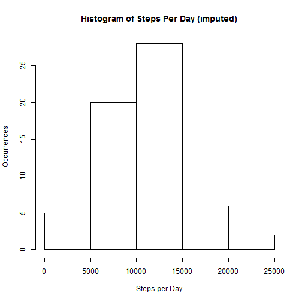
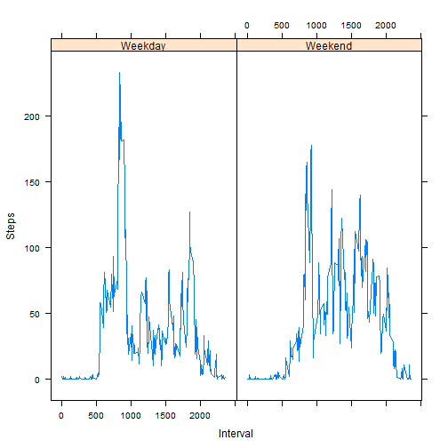

This is an R Markdown document. Markdown is a simple formatting syntax for authoring HTML, PDF, and MS Word documents. For more details on using R Markdown see <http://rmarkdown.rstudio.com>.

When you click the **Knit** button a document will be generated that includes both content as well as the output of any embedded R code chunks within the document. You can embed an R code chunk like this:

===

Here we will load the libraries necessary:  


```r
library(dplyr)
library(lubridate)
library(lattice)
```

Now we will download the data set if needed:  


```r
old_dir <- getwd()
setwd("c:/users/dansc/documents/coursera/reproducible research/project1")
if (!file.exists("repdata-data-activity.zip")){
    download.file("https://d396qusza40orc.cloudfront.net/repdata%2Fdata%2Factivity.zip", destfile = "repdata-data-activity.zip")
}
if (!file.exists("activity.csv")) {
    unzip("repdata-data-activity.zip")
}
```

Now we load the data set:  


```r
data <- read.csv("activity.csv")
```

First, we will remove the missing values from the data set. We know these missing
values will skew the data set somewhat, but we will compare with imputed data later.
Also, we modify the date column to be of class Date instead of a Factor. We also
add a column named "day" for later use.


```r
data <- data[!is.na(data$steps), ]
data$date <- as.Date(data$date)
data$day <- weekdays(data$date)
```

Now, we use dplyr to group the data frame by date, convert the steps column
to a numeric and summarize the sum of the steps per day and generate a histogram.  


```r
grb <- group_by(data, date)
grb$steps <- as.numeric(grb$steps)
stepcounts <- summarize(grb, steps = sum(steps))
hist(stepcounts$steps, xlab="Steps per Day", ylab="Occurrences", main="Histogram of Steps Per Day")
```



Now we print the mean stepcount per day and the median stepcount per day...  


```r
print("Average Steps Per Day")
```

```
## [1] "Average Steps Per Day"
```

```r
print(mean(stepcounts$steps))
```

```
## [1] 10766.19
```

```r
print("Median Steps Per Day")
```

```
## [1] "Median Steps Per Day"
```

```r
print(median(stepcounts$steps))
```

```
## [1] 10765
```

and plot the stepcount per day.  


```r
plot(stepcounts$steps ~ stepcounts$date, xlab = "Date", ylab = "Steps", type = "o", pch = 15)
```



Now, we calculate the average steps taken in each interval and
then find the interval where the user took the most steps on average
over the 2 month period.  


```r
gri <- group_by(data, interval)
gri$steps <- as.numeric(gri$steps)
sumgri <- summarize(gri, steps = mean(steps))
sumgri$interval <- as.numeric(sumgri$interval)
sumgri <- arrange(sumgri, interval)
print("Highest Average Step Interval")
```

```
## [1] "Highest Average Step Interval"
```

```r
print(filter(sumgri, steps == max(sumgri$steps)))
```

```
## Source: local data frame [1 x 2]
## 
##   interval    steps
##      (dbl)    (dbl)
## 1      835 206.1698
```

# IMPUTING DATA FOR MISSING VALUES
All missing values were from entire days meaning that no missing
values had non-missing adjacent values (which would be preferable
for imputation). So, we will have to use information from other
days to impute likely number of steps for these days. Since people's
routines are most often determined by the day of the week, we will impute
missing values using the mean of steps in that interval on that day of the week.  


```r
grd <- group_by(data, interval, day)
sumgrd <- summarize(grd, steps = mean(steps))

## find the values for all missing steps
data2 <- read.csv("activity.csv")
data2$date <- as.Date(data2$date)
data2$day <- weekdays(data2$date)
missing <- data2[is.na(data2$steps),]
for (i in seq_along(missing$steps)) {
    missing$steps[[i]] <- filter(sumgrd, interval == missing$interval[[i]], day == missing$day[[i]])[[3]]
    i = i + 1
}
```

Now we reload the data set and replace NA values with imputed "missing" data.


```r
data3 <- read.csv("activity.csv")
data3$date <- as.Date(data3$date)
data3$day <- weekdays(data3$date)
data3[is.na(data3$steps), 1] <- missing[missing$date == data3$date & missing$interval == data3$interval, 1]
```

```
## Warning in `==.default`(missing$date, data3$date): longer object length is
## not a multiple of shorter object length
```

```
## Warning in missing$interval == data3$interval: longer object length is not
## a multiple of shorter object length
```

Now we repeat the histogram of the total steps per day with the imputed data...


```r
grb <- group_by(data3, date)
grb$steps <- as.numeric(grb$steps)
sumgrd <- summarize(grb, steps = sum(steps))
hist(sumgrd$steps, xlab="Steps per Day", ylab="Occurrences", main="Histogram of Steps Per Day (imputed)")
```



and the mean and median.


```r
print("Average Steps Per Day")
```

```
## [1] "Average Steps Per Day"
```

```r
print(mean(sumgrd$steps))
```

```
## [1] 10662.41
```

```r
print("Median Steps Per Day")
```

```
## [1] "Median Steps Per Day"
```

```r
print(median(sumgrd$steps))
```

```
## [1] 10395
```

Now we add a Weekday column...
and plot the panels.


```r
data3 <- mutate(data3, weekday = ifelse(day == "Saturday" | day == "Sunday", "Weekend", "Weekday"))
data3$date <- as.factor(data3$date)
grw <- group_by(data3, interval, weekday)
grw$weekday <- as.factor(grw$weekday)
meangrw <- summarize(grw, steps = mean(steps))
meangrw$weekday <- as.factor(meangrw$weekday)
xyplot(meangrw$steps ~ meangrw$interval | meangrw$weekday, type="l", xlab="Interval", ylab="Steps")
```



We note that the mean and median steps per day are lower after imputing data for the missing values.
This aligns with the fact that there were more missing data on weekdays than weekends, 
and weekday step traffic is lower than weekend.
